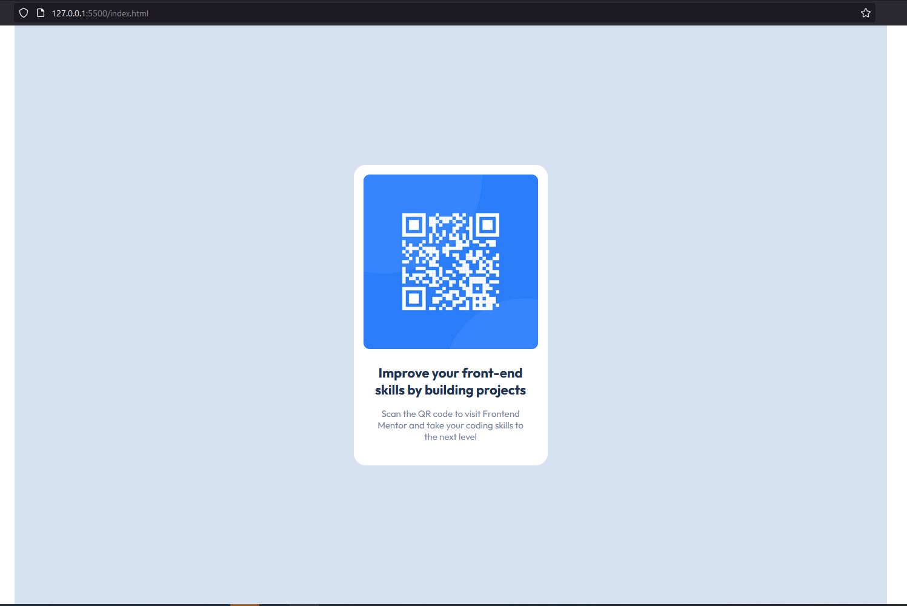

# Frontend Mentor - QR code component solution

This is a solution to the [QR code component challenge on Frontend Mentor](https://www.frontendmentor.io/challenges/qr-code-component-iux_sIO_H). Frontend Mentor challenges help you improve your coding skills by building realistic projects.

## Table of contents

- [Overview](#overview)
  - [Screenshot](#screenshot)
  - [Links](#links)
- [My process](#my-process)
  - [Built with](#built-with)
  - [What I learned](#what-i-learned)
  - [Continued development](#continued-development)
  - [Useful resources](#useful-resources)
- [Author](#author)

## Overview

### Screenshot

### Links

- Solution URL: [Add solution URL here](https://github.com/jiricmiel/jiricmiel.github.io)
- Live Site URL: [Add live site URL here](https://jiricmiel.github.io/)

## My process

### Built with

- CSS custom properties
- SASS
- CSS Grid
- Desktop-first workflow

### What I learned

During this project I've learned version controll system. Well, at least the verry begining of it.
I also tackled SASS partials a bit more and used CSS custom properties for the first time.
I also leaned towards using HSL instead of HEX.

### Continued development

In the future I'm ready to dig in JS for sure as I've already started the learning proces.
In regards of HTML & CSS I'm going to continue my learning and deepening of my knowledge as there is so much of it and it's only the begining.
I'll probably stick with using SASS (.scss).

### Useful resources

- [Example resource 1](https://github.com/kevin-powell) - Kevin is amazing guide for everything regarding HTML & CSS.
- [Example resource 2](https://github.com/jonasschmedtmann) - Jonas has amazing courses at Udemy. It helped me a lot with everything I know up tu date.

## Author

- Frontend Mentor - [@yourusername](https://www.frontendmentor.io/profile/jiricmiel)
- Twitter - [@yourusername](https://www.twitter.com/yourusername)
